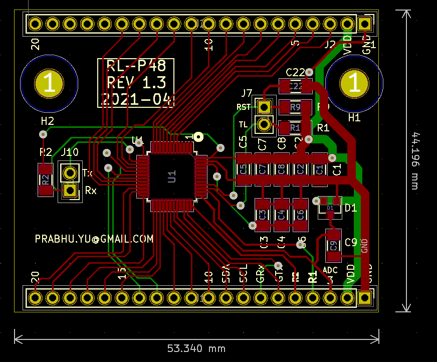

# GSM-RL78-PCB

- Designed using KiCAD PCB Design SW.
- GSM modem Interface to RL78 uC using AT-MODEM commands over UART. Using this, we can build 2G/3G/4G wireless automation device. 
    - For example: to switch a remote high power motors, to monitor status using SMS/phone call. 
- The embedded C code to issue GSM AT Commands is available in another repo in my same gitHub account.

I plan to write a better documentation on my personal site:  
[https://prabhu-yu.github.io/](https://prabhu-yu.github.io/)

-
Thank You.  
Prabhu. Ullagaddi.
